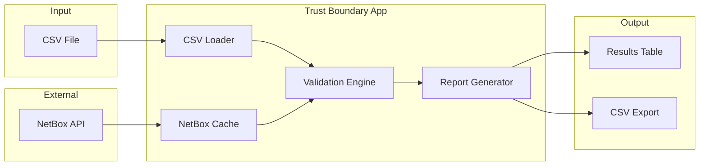
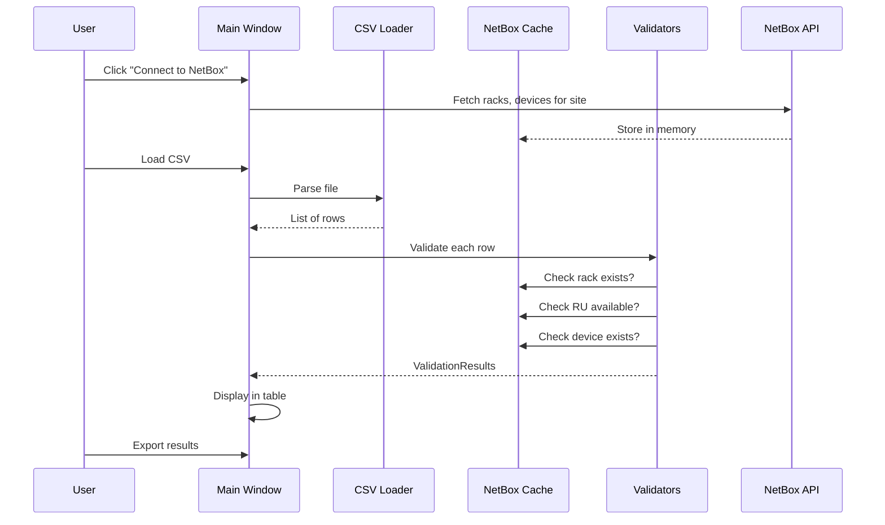

# NetBox Trust Boundary v1 - Implementation Plan

## Architecture Overview



## Target Environment

- **NetBox**: 3.4.x (REST API)
- **Python**: 3.10+
- **UI Framework**: PySide6
- **Target Site**: Pico (Los Angeles) for beta testing

## CSV Contract (Input Format)

| Column | Required | Example |

|--------|----------|---------|

| `rack` | Yes | `ER100-161` |

| `make` | No | `Ericsson` |

| `model` | No | `RX 8200` |

| `hostname` | No | `RCBR 105` |

| `ru_position` | Yes | `22` |

| `ru_height` | Yes | `2` |

Rows missing required fields are flagged as `INVALID`, not skipped.

## Validation Rules

| Check | Result if Fails |

|-------|-----------------|

| Required fields present | `INVALID` - missing field noted |

| Rack exists in NetBox | `FAIL` - rack not found |

| RU position in valid range | `FAIL` - out of bounds |

| RU position available | `WARN` - reports current occupant |

| Device already exists (name+site+rack) | `INFO` - no action needed |

| Naming convention match | `WARN` - optional, pluggable |

## Output Classification

Each row receives one of:

- `NO_ACTION` - Already correct in NetBox
- `NETBOX_UPDATE` - Safe to import
- `REVIEW_REQUIRED` - Conflict or ambiguity
- `INVALID` - Cannot process, data issue

## Project Structure

```
netbox-trust-boundary/
├── [README.md](README.md)
├── [requirements.txt](requirements.txt)
├── [config.yaml.example](config.yaml.example)
├── [main.py](main.py)                     # Entry point
├── core/
│   ├── [netbox_client.py](core/netbox_client.py)    # API client + caching
│   ├── [csv_loader.py](core/csv_loader.py)          # CSV parsing + validation
│   ├── [models.py](core/models.py)                  # Data classes
│   └── [validators.py](core/validators.py)          # All validation logic
├── ui/
│   ├── [main_window.py](ui/main_window.py)          # Main application window
│   ├── [results_table.py](ui/results_table.py)      # Results display widget
│   └── [config_dialog.py](ui/config_dialog.py)      # Settings/connection config
└── tests/
    ├── [test_validators.py](tests/test_validators.py)
    └── [sample_data.csv](tests/sample_data.csv)
```

## Key Components

### 1. NetBox Client ([core/netbox_client.py](core/netbox_client.py))

- Connects to NetBox REST API (read-only)
- Fetches and caches: sites, racks, devices, rack elevations
- Cache refreshes on demand (button in UI)
- Scoped to single site (Pico for v1)

### 2. CSV Loader ([core/csv_loader.py](core/csv_loader.py))

- Parses CSV with flexible column mapping
- Validates required fields present
- Normalizes data (strip whitespace, parse RU numbers)
- Returns list of row objects + parse errors

### 3. Validators ([core/validators.py](core/validators.py))

- `validate_row(row, cache)` - runs all checks on single row
- Returns `ValidationResult` with status + reasons
- Modular: easy to add new checks later

### 4. Main Window ([ui/main_window.py](ui/main_window.py))

- Load CSV button
- Connect to NetBox / refresh cache
- Results table (sortable, filterable by status)
- Export results button
- Status bar showing cache age, row counts

## Data Flow



## Build Order

1. **Core models** - Data classes for rows, results, cache entries
2. **NetBox client** - API connection, fetch methods, caching
3. **CSV loader** - Parse and validate CSV structure
4. **Validators** - Implement each check
5. **UI shell** - Main window, basic layout
6. **Results table** - Display validation output
7. **Wire it together** - Connect UI to core logic
8. **Export** - CSV output of results
9. **Config dialog** - NetBox URL/token settings

## Configuration

`config.yaml`:

```yaml
netbox:
  url: "https://netbox.example.com"
  token: "your-api-token"
  site: "los-angeles"  # Pico facility

validation:
  naming_pattern: null  # Optional regex, null = skip check
```

Environment variable overrides: `NETBOX_URL`, `NETBOX_TOKEN`

## What This Plan Does NOT Include

- Writing to NetBox (explicit non-goal)
- AutoCAD parsing (junior engineer's separate tool)
- IP/prefix validation (future version)
- Multi-site support (v1 is Pico only, architecture supports expansion)
- Split-RU / half-rack device handling (flagged as REVIEW_REQUIRED for v1)